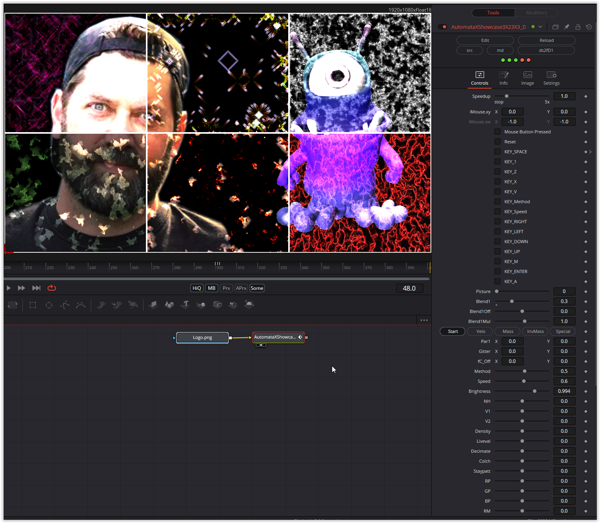

The "Picture" parameter allows you to customize the individual automata. You can blend textures, and there are countless other parameters.

Have fun playing!

### Description of the Shader in Shadertoy:
Fullscreen recommended.

CONTROLS:  Enter=switch to 3x3, 7-9=speed, m=see automata, a=antialiasing, space=regenerate

ZOOM: Mouse x zooms, arrow keys pan.
