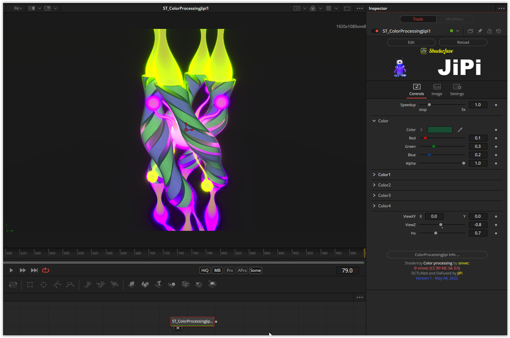

# ColorProcessing

This Fuse is based on the Shadertoy '_[Color processing](https://www.shadertoy.com/view/7tfBzs)_' by [sinvec](https://www.shadertoy.com/user/sinvec). Conversion to DCTL and encapsulation into a fuse done by [JiPi](../../Site/Profiles/JiPi.md). See [ShaderOfTheWeek](README.md) for more fuses in this category.

<!-- +++ DO NOT REMOVE THIS COMMENT +++ DO NOT ADD OR EDIT ANY TEXT BEFORE THIS LINE +++ IT WOULD BE A REALLY BAD IDEA +++ -->

<!-- +++ DO NOT REMOVE THIS COMMENT +++ DO NOT EDIT ANY TEXT THAT COMES AFTER THIS LINE +++ TRUST ME: JUST DON'T DO IT +++ -->

## Compatibility

🟩 macOS / Metal: checked 
⬛ macOS / OpenCL: NOT TESTED! 
🟩 Windows / CUDA: checked 
🟩 Windows / OpenCL: checked 

## Problems

Number of problems: 1

- macOS_OpenCL compatibility not checked

