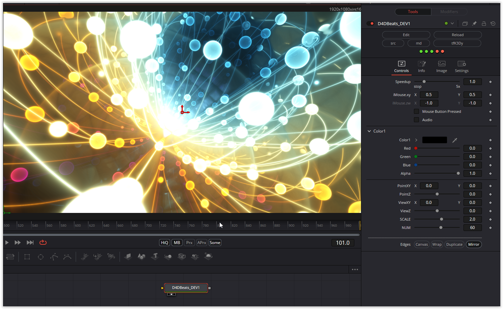

### Description of the Shader in Shadertoy:
CC0: 4D Beats
 Continuing experiments with yesterday's grid structure
 Note: Music may require clicking play/stop to initialize
 Shader animation depends on audio input - static without music
 BPM: 114