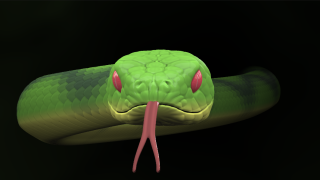

# DangerNoodle

Based on '_[DangerNoodle](https://www.shadertoy.com/view/wlVSDK)_' by [BigWIngs](https://www.shadertoy.com/user/BigWIngs) and ported by [JiPi](../../Site/Profiles/JiPi.md).

A very nice shader, which uses two cubemaps to show the background and the surface of the snake very well.
In the shader fuse, the color of the top and bottom, the eyes and the tongue can be changed.

## Compatibility
- [x] Tested on macOS/Metal
- [ ] Tested on macOS/OpenCL
- [X] Tested on Windows/Cuda
- [X] Tested on Windows/OpenCL
