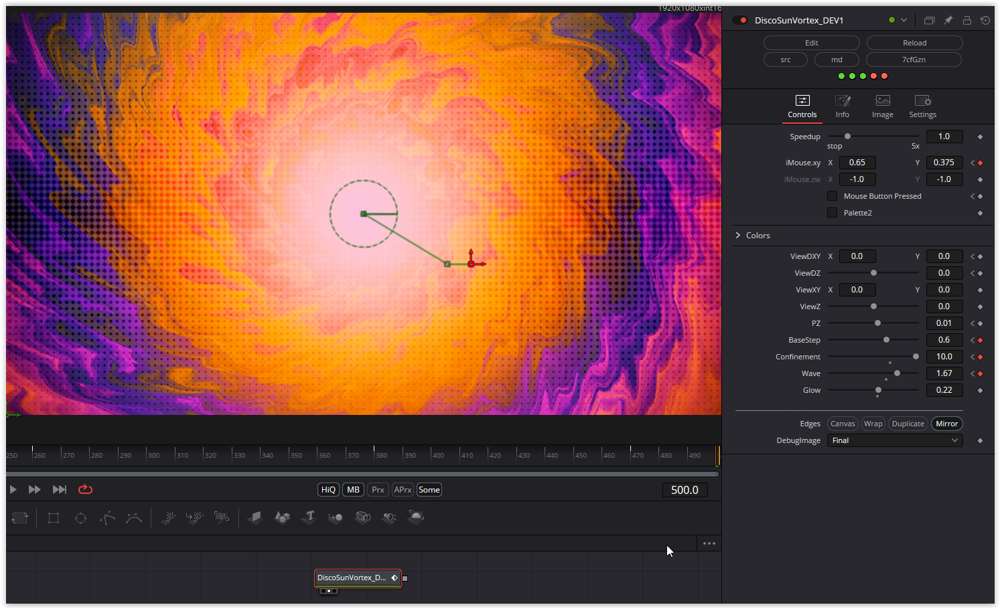

### Description of the Shader in Shadertoy:
Disco Sun is a raymarched corkscrew tunnel wrapped in a warm cosine palette.
Depth-driven rotation shapes the solar vortex while a time-gated matrix of pulsating dots overlays rhythmic energy.