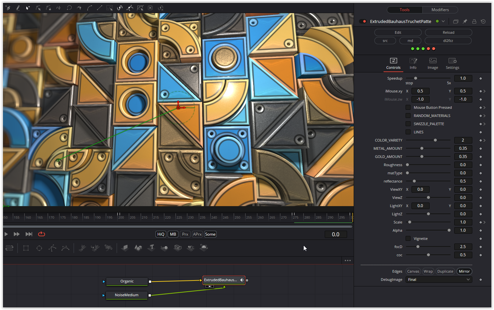

A great truchet shader. I added a lot of parameters.

Have fun playing

### Description of the Shader in Shadertoy:
An extruded Bauhaus Truchet pattern with a simplistic Cook-Torrance diffuse and specular lighting scheme applied to give the vague appearance of hard ceramic and metal tiles.