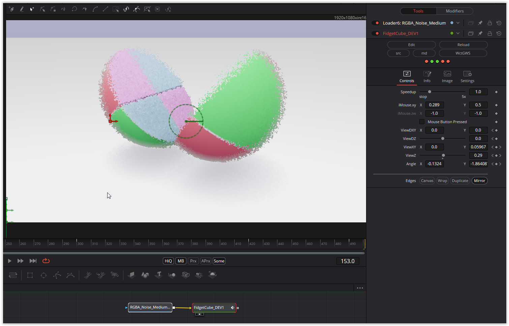

This is the first time I've emulated a CubeMapA buffer in DCTL. I thought I'd be pushing the envelope for performance, but this fuse is calculated in real time.

There are also a huge number of matrix multiplications. A total of 85 mat4 multiplied by mat4 operations. The texture is used for the edges during the transformation. You can manually control the transformations with the mouse parameters.

Have fun playing!

### Description of the Shader in Shadertoy:
Similar to a toy I have on my desk.

This is lit only with an environment map and ambient occlusion, which looks nice as long as you use big, soft lights.