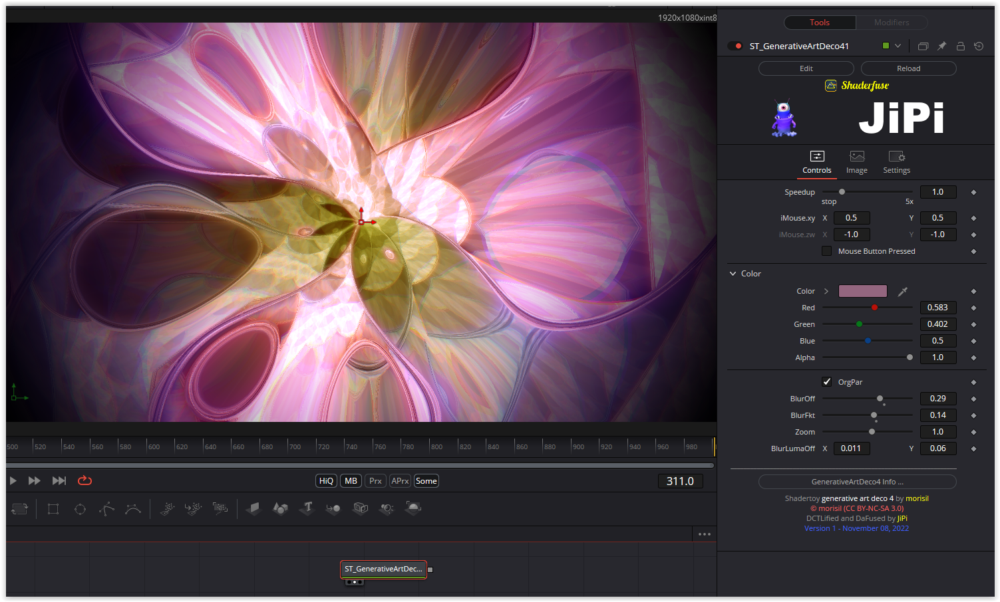

# GenerativeArtDeco4

Based on '_[generative art deco 4](https://www.shadertoy.com/view/mds3DX)_' by [morisil](https://www.shadertoy.com/user/morisil) and ported by [JiPi](../../Site/Profiles/JiPi.md).

## Compatibility
- [ ] Tested on macOS/Metal
- [ ] Tested on macOS/OpenCL
- [X] Tested on Windows/Cuda
- [X] Tested on Windows/OpenCL
