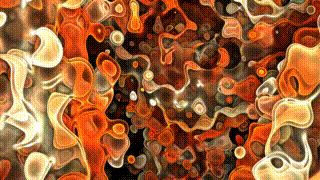
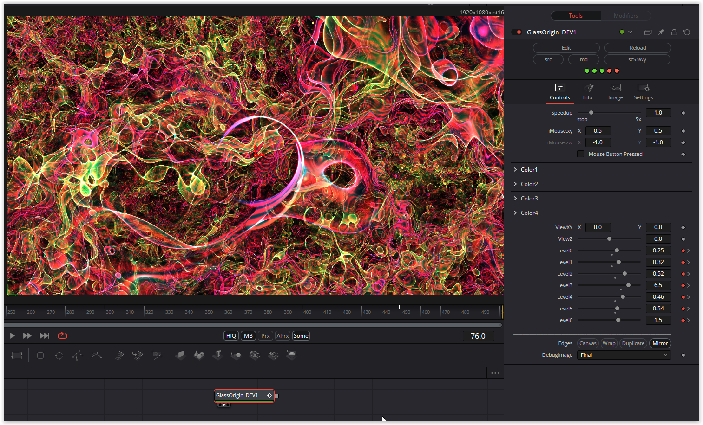

A very nice tunnel shader variant

Have fun playing

### Description of the Shader in Shadertoy:
Using volumetric translucency and oscillating color i to imitate glass.

Inspired by diatribes tunnel marcher series. Here is where I learned: shadertoy.com/view/wXcBzX