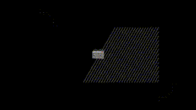
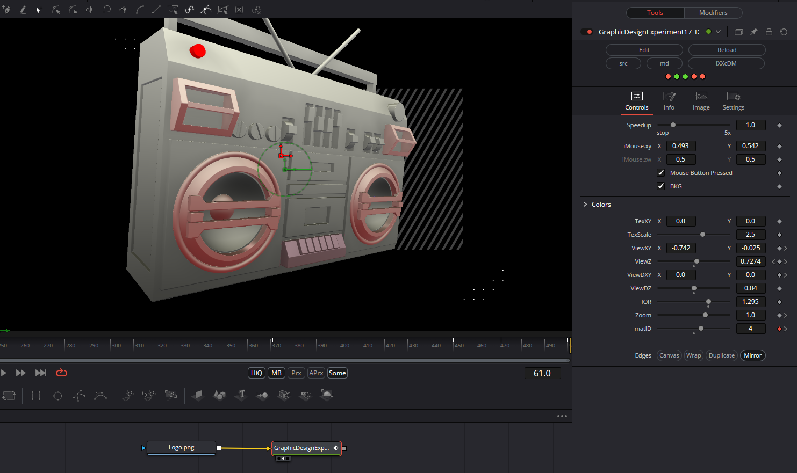

An image can be set on the back of the device. The `matID` parameter allows you to select the object whose color you wish to adjust using `ColVar1` and `ColVar2`. The background can be turned off or set to transparent, and there are numerous options for rotating and tilting the device.

Have fun playing!

### Description of the Shader in Shadertoy:
boombox