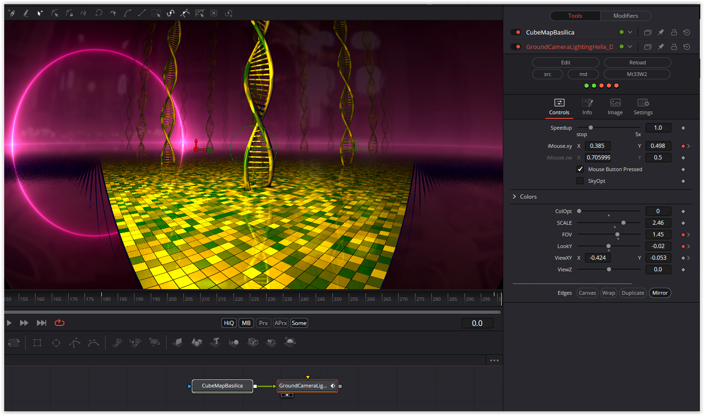

### Description of the Shader in Shadertoy:
Tiled floor, camera and lighting practice with the DNA from other shaders added to make things a bit more interesting. The shader will "run out of color" at around 5 - 10 minutes. Haven't figured that part out yet, maybe it's the noise function.

