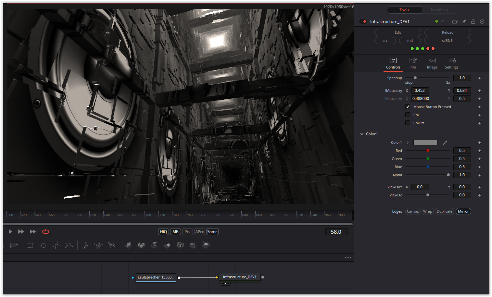

### Description of the Shader in Shadertoy:
A raymarching scene with a simple greeble technique to add details to surfaces, although there's still some artifacts and aliasing issues resulting from this technique.
