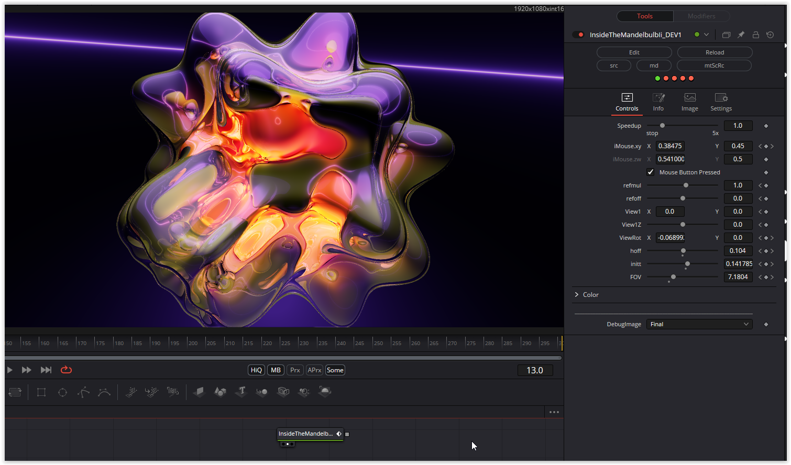

A fascinating play with form and colour. The object can be rotated with the mouse parameter. The viewing angle can be changed with the view parameters.
Refraction parameters and color parameters for background and envelope complete the fuse.

Have fun

### Description of the Shader in Shadertoy:
CC0: Inside the mandelbulb II
Received some "complaints" about the old mandelbulb suffering from
alias effects. So thought I make a quick try to apply the FXAA
thing I learnt from XorDev. It did improve it but not perfect still.