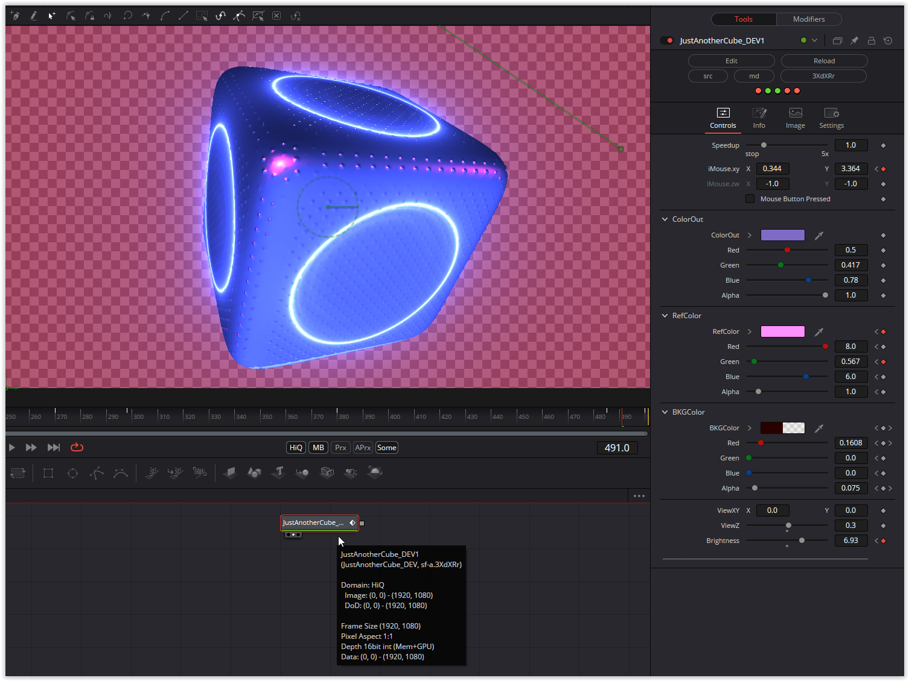

A nice, compact shader. The cube can be rotated using the mouse parameter. The background color and reflection color are adjustable. The cube's alpha is set using ColorOut, and the background's alpha is set using BKGColor.

Enjoy playing!

### Description of the Shader in Shadertoy:
CC0: Just another cube
 Glowtracers are great for compact coding but I wanted to see how much
 I could squeeze a more normal raymarcher in terms of characters used