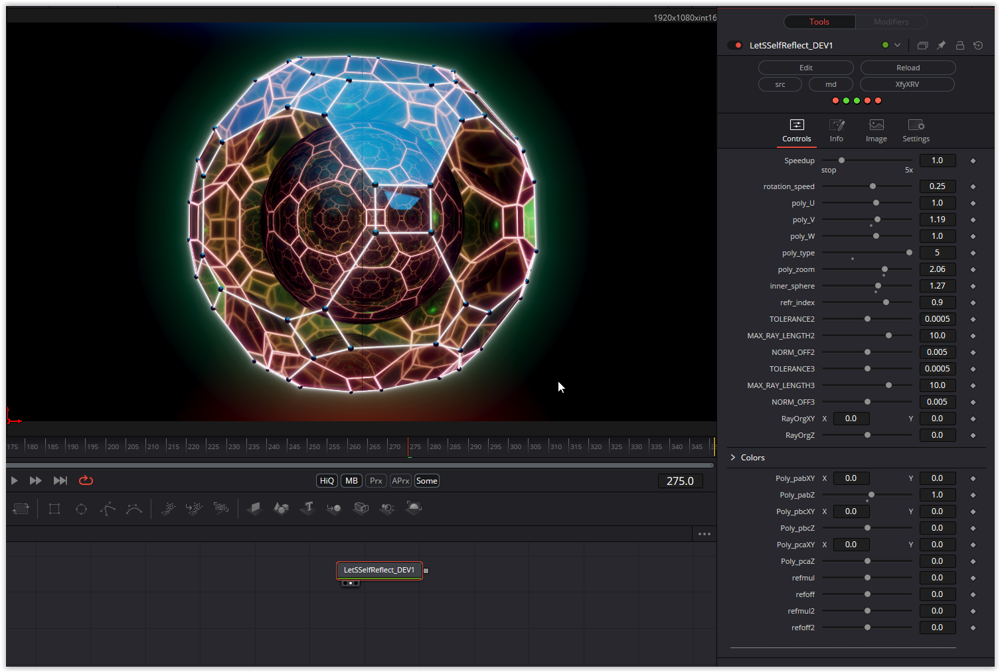

With refraction there is the well-known problem that can be solved with the help of two parameters. Since two refractions are used here, there are also 4 parameters for it.
Otherwise, colors and shapes can be changed using countless setting options.

Have fun playing

### Description of the Shader in Shadertoy:
CC0: Let's self reflect
Always enjoyed the videos of Platonic solids with inner mirrors
I made some previous attempts but thought I make another attempt it
