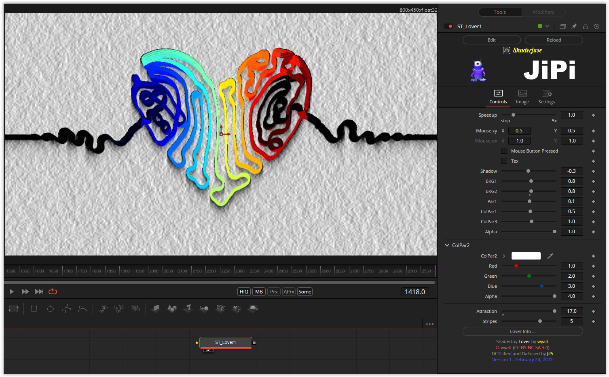

<!-- +++ DO NOT REMOVE THIS COMMENT +++ DO NOT ADD OR EDIT ANY TEXT BEFORE THIS LINE +++ IT WOULD BE A REALLY BAD IDEA +++ -->

A cool shader that uses all four buffers. I implemented a few parameters to play with. Among other things, you can connect a texture, which then specifies the shape, with the snake being placed where the alpha channel is set to 1 in the texture.

The image depth is fixed here at float32, since otherwise no calculation via the buffer is possible. The default resolution is set to 800x450 pixels but can be changed in Page Image.

Have fun playing

<!-- +++ DO NOT REMOVE THIS COMMENT +++ DO NOT EDIT ANY TEXT THAT COMES AFTER THIS LINE +++ TRUST ME: JUST DON'T DO IT +++ -->
