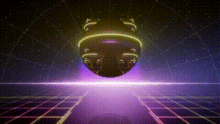
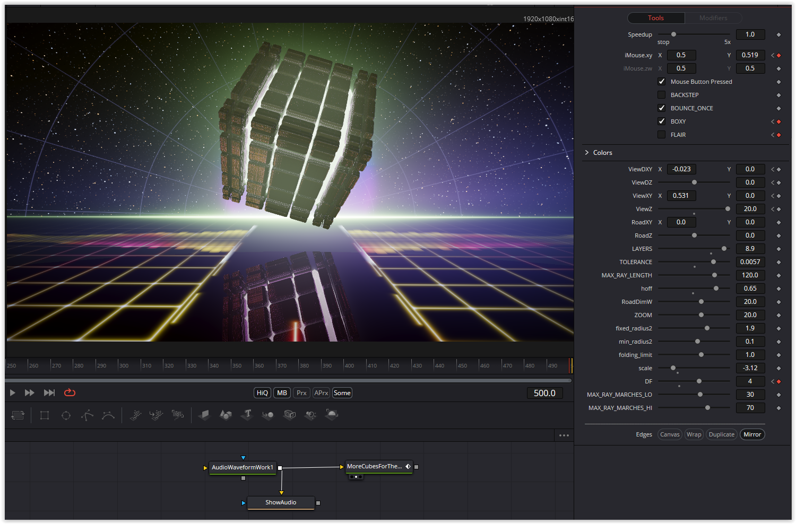

The `define` statements here had to be converted on a large scale. The central parameter is `DF`; it allows the various objects to be represented. Not all parameters are used for every object—just play around with it.

Have fun!

### Description of the Shader in Shadertoy:
CC0: More "cubes" for the cube lovers
  Tinkering around with glow effects and one bounce reflections
  Produced a few interesting "cubes" that some might enjoy.