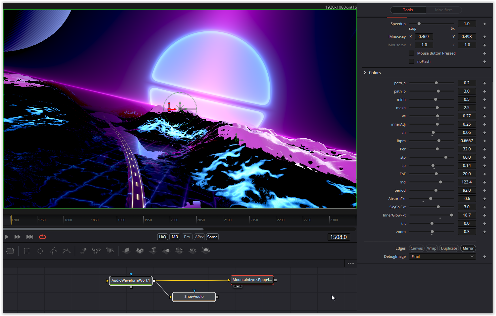

Another challenge for the conversion, but it was worth it, a very nice shader. I added a lot of uniforms.

Have fun playing

### Description of the Shader in Shadertoy:
CCO: Phosphorescent Purple Pixel Peaks 4KiB Windows Exe

Our contribution to MountainBytes 2024.
Music: Virgill
Music player: Pestis
GLSL: mrange

https://demozoo.org/productions/338637/