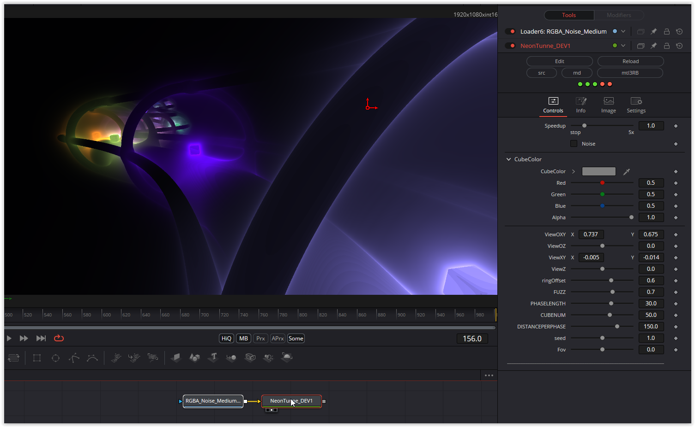

Interesting creation of the tunnel using mat4 matrices. The coloring of the cubes is created with a colorful noise texture. I added some parameters to play with.

Have fun playing

### Description of the Shader in Shadertoy:
Quick and dirty sketch for a project at work which never got the green lights