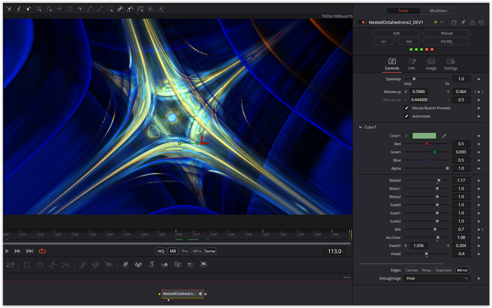

Another shader that didn't work with OpenCL at first, only after adding

int RowSampler = 15;

did it work with OpenCL.

I'll probably never understand this "bug", well, as a pragmatist it works, but I don't know why :-)

Have fun playing

### Description of the Shader in Shadertoy:
forked from: https://www.shadertoy.com/view/lXdSzs , see below for how to make a clickable link...
