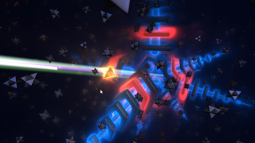

# NightCircuit

This Fuse is based on the Shadertoy '_[Night circuit](https://www.shadertoy.com/view/tdyBR1)_' by [gaz](https://www.shadertoy.com/user/gaz). Conversion to DCTL and encapsulation into a fuse done by [JiPi](../../Site/Profiles/JiPi.md). See [ShaderOfTheWeek](README.md) for more fuses in this category.

<!-- +++ DO NOT REMOVE THIS COMMENT +++ DO NOT ADD OR EDIT ANY TEXT BEFORE THIS LINE +++ IT WOULD BE A REALLY BAD IDEA +++ -->

There is a striking performance difference between Cuda and OpenCL. While the shader is rendered loosely in real time with Cuda, with OpenCL each image is rendered individually to the screen. Possibly the use of the arrays is the cause.

<!-- +++ DO NOT REMOVE THIS COMMENT +++ DO NOT EDIT ANY TEXT THAT COMES AFTER THIS LINE +++ TRUST ME: JUST DON'T DO IT +++ -->

## Compatibility

⬛ macOS / Metal: NOT TESTED! 
⬛ macOS / OpenCL: NOT TESTED! 
🟩 Windows / CUDA: checked 
🟩 Windows / OpenCL: checked 

## Problems

Number of problems: 3

- Thumbnail seems to be not a 320x180 pixel PNG
- macOS_Metal compatibility not checked
- macOS_OpenCL compatibility not checked

