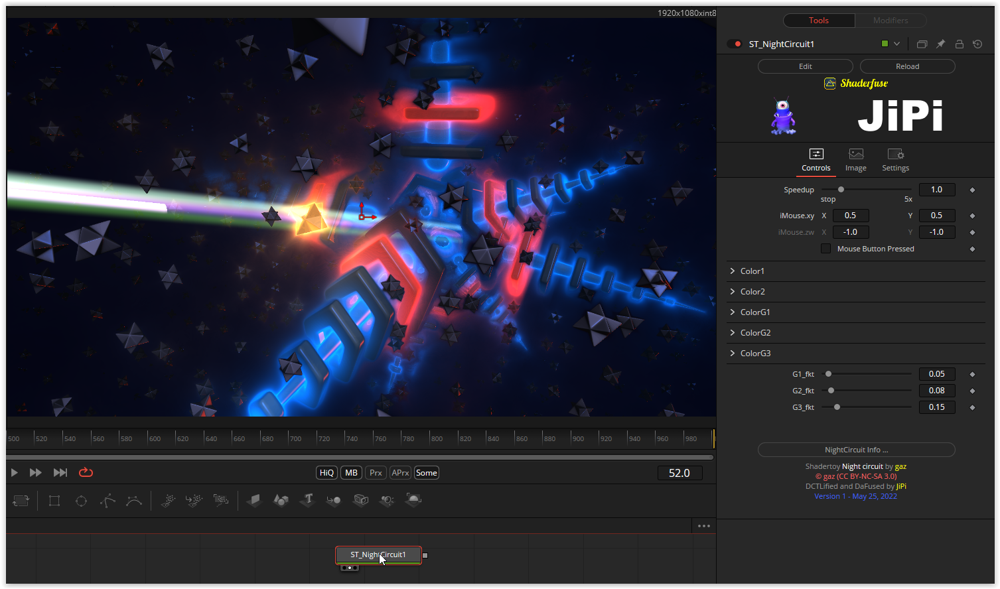

There is a striking performance difference between Cuda and OpenCL. While the shader is rendered loosely in real time with Cuda, with OpenCL each image is rendered individually to the screen. Possibly the use of the arrays is the cause.

