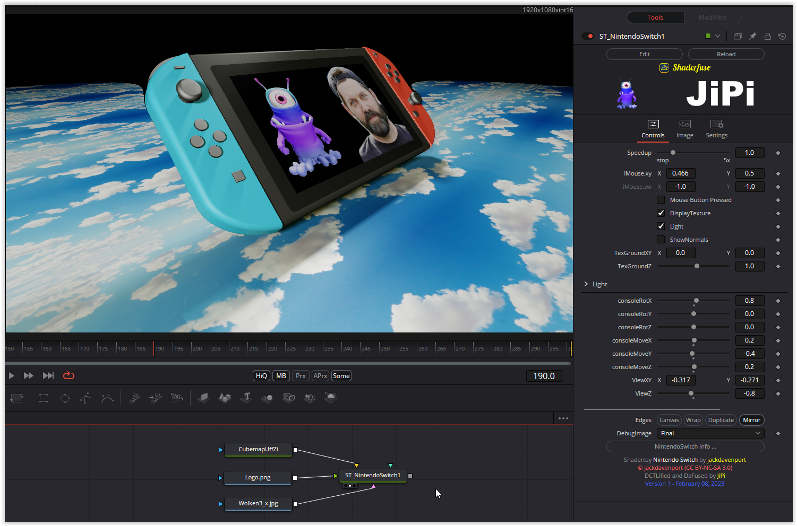

A game console rotates in space. Two light sources create shadows.
When the mouse is switched on, the automatic flight is interrupted and you can continue manually. In addition, the viewing angle (ViewXY,ViewZ) and the camera position (LookXY,LookZ) can be changed. With the DisplayTexture switch, a texture can be shown directly in the display instead of the one created in the original shader. A cubmap gives an additional spatial impression.
The light angle and the ambient light can be adjusted.
And the console can be rotated and moved in all three axes.

Have fun playing

