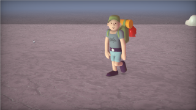

# OnTheSal

This Fuse is based on the Shadertoy '_[On the salt lake](https://www.shadertoy.com/view/fsXcR8)_' by [iapafoto](https://www.shadertoy.com/user/iapafoto). Conversion to DCTL and encapsulation into a fuse done by [JiPi](../../Site/Profiles/JiPi.md). See [ShaderOfTheWeek](README.md) for more fuses in this category.

<!-- +++ DO NOT REMOVE THIS COMMENT +++ DO NOT ADD OR EDIT ANY TEXT BEFORE THIS LINE +++ IT WOULD BE A REALLY BAD IDEA +++ -->

A very complex shader that was created with the great "Fetch-N-Fuse process". The shader toy source code is converted via a Python script, tested and adapted with an "incubator fuse" and finally the final fuse is assembled with another Python script.
With this shader, in addition to an unsightly artifact in the background, there is the phenomenon that the ray marching no longer draws a figure from a certain position. Despite intensive troubleshooting, I was unfortunately unable to find the error :-(

Anyway have fun

<!-- +++ DO NOT REMOVE THIS COMMENT +++ DO NOT EDIT ANY TEXT THAT COMES AFTER THIS LINE +++ TRUST ME: JUST DON'T DO IT +++ -->

## Compatibility

⬛ macOS / Metal: NOT TESTED! 
⬛ macOS / OpenCL: NOT TESTED! 
🟩 Windows / CUDA: checked 
🟩 Windows / OpenCL: checked 

## Problems

Number of problems: 3

- Thumbnail seems to be not a 320x180 pixel PNG
- macOS_Metal compatibility not checked
- macOS_OpenCL compatibility not checked

