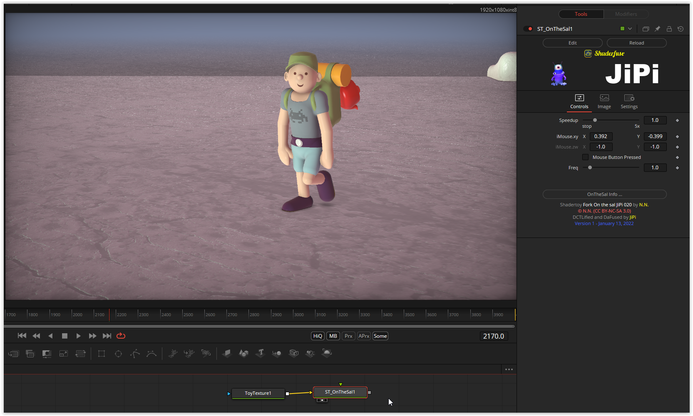

A very complex shader that was created with the great "Fetch-N-Fuse process". The shader toy source code is converted via a Python script, tested and adapted with an "incubator fuse" and finally the final fuse is assembled with another Python script.
With this shader, in addition to an unsightly artifact in the background, there is the phenomenon that the ray marching no longer draws a figure from a certain position. Despite intensive troubleshooting, I was unfortunately unable to find the error :-(

Anyway have fun

