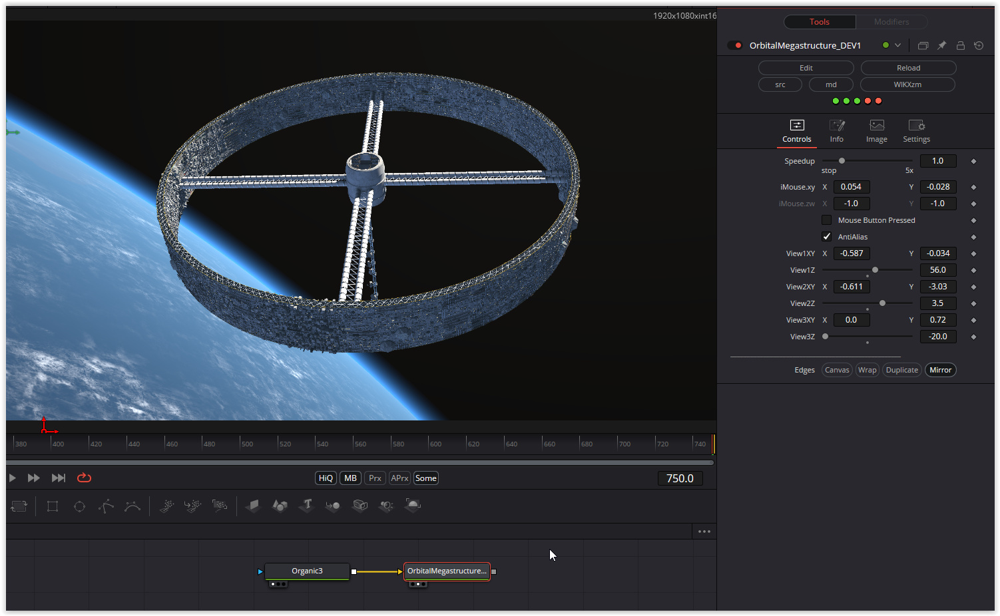

Another complex shader with great attention to detail.

Have fun playing

### Description of the Shader in Shadertoy:
I wanted to make a space station that feels big. This is spinning at a rate that would make for 1 G of gravity if the diameter is 8 km. I was trying really hard for cinema-quality.