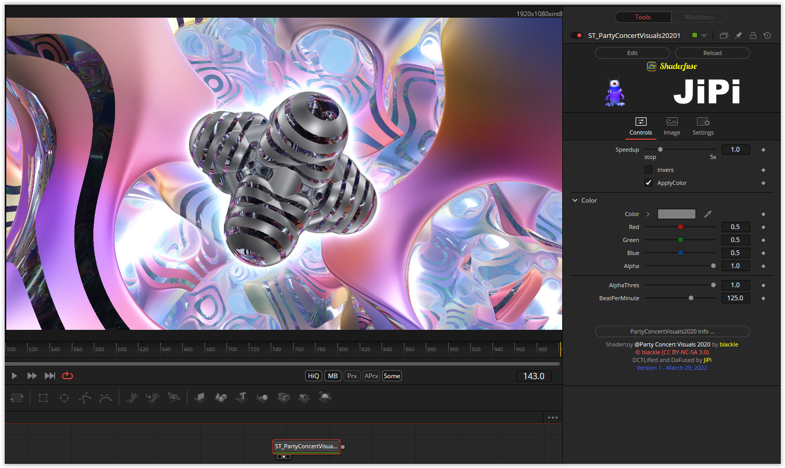

# PartyConcertVisuals2020

This Fuse is based on the Shadertoy '_[@Party Concert Visuals 2020](https://www.shadertoy.com/view/WtscW4)_' by [blackle](https://www.shadertoy.com/user/blackle). Conversion to DCTL and encapsulation into a fuse done by [JiPi](../../Site/Profiles/JiPi.md). See [ShaderOfTheWeek](README.md) for more fuses in this category.

<!-- +++ DO NOT REMOVE THIS COMMENT +++ DO NOT ADD OR EDIT ANY TEXT BEFORE THIS LINE +++ IT WOULD BE A REALLY BAD IDEA +++ -->

The "ApplyColor" checkbox activates the "Color" and "AlphaThres" parameters so that the color and the alpha channel can be changed. If the checkbox is switched off (0), this corresponds to the original shader.

Update on April 1st:

The shader "Fork @Party Con qb777 479" (https://www.shadertoy.com/view/flfcD2) is integrated and can be selected via the "Fork" checkbox.

<!-- +++ DO NOT REMOVE THIS COMMENT +++ DO NOT EDIT ANY TEXT THAT COMES AFTER THIS LINE +++ TRUST ME: JUST DON'T DO IT +++ -->

## Compatibility

⬛ macOS / Metal: NOT TESTED! 
⬛ macOS / OpenCL: NOT TESTED! 
🟩 Windows / CUDA: checked 
🟩 Windows / OpenCL: checked 

## Problems

Number of problems: 2

- macOS_Metal compatibility not checked
- macOS_OpenCL compatibility not checked

