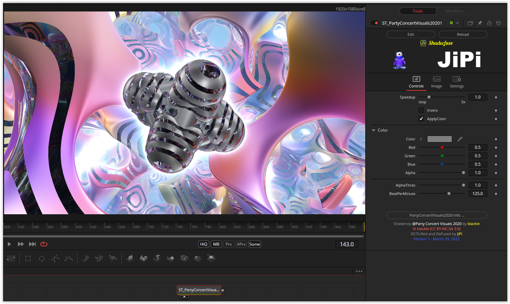

The "ApplyColor" checkbox activates the "Color" and "AlphaThres" parameters so that the color and the alpha channel can be changed. If the checkbox is switched off (0), this corresponds to the original shader.

Update on April 1st:

The shader "Fork @Party Con qb777 479" (https://www.shadertoy.com/view/flfcD2) is integrated and can be selected via the "Fork" checkbox.

