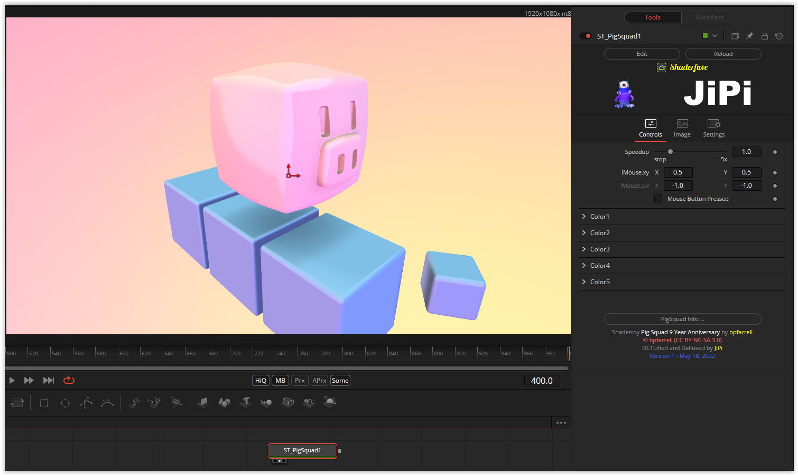

A very cute shader that is now celebrating its nine year anniversary.
I added parameters for all part colors. Color1's alpha controls the pig and block, and Color3's alpha controls background transparency.

