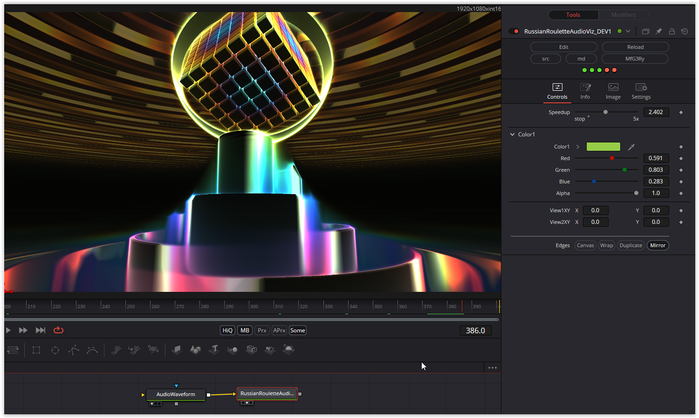

To visualize an audio signal you need the "AudioWaveform.fuse". You can download it here: https://github.com/nmbr73/Shaderfuse/releases/download/V1.1/AudioWaveform-Installer.lua.

Have fun playing

