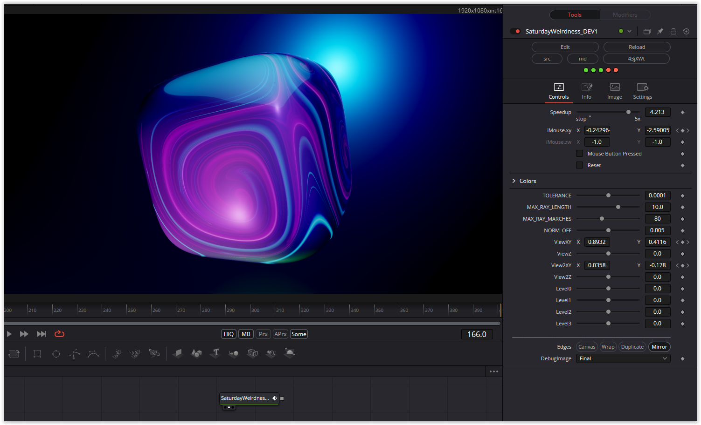

### Description of the Shader in Shadertoy:
CC0: Saturday weirdness
I saw a tweet from Kali where I thought I understood how he did something cool.
Turns out I didn't understand . Instead ended up with weird stuff.
