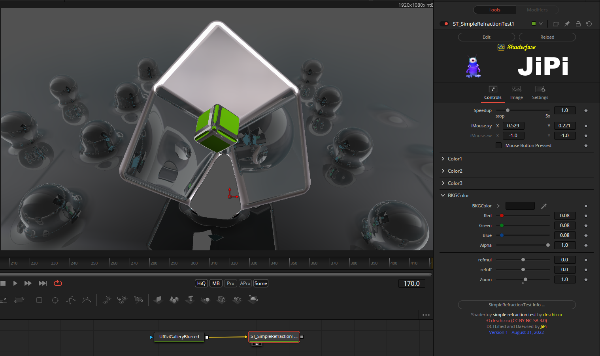

A very nice shader with refraction, unfortunately the result can only be generated with Cuda. With OpenCL, compiling takes forever and only the cuboid appears as a result, the drops are only rendered rudimentarily.

