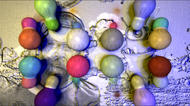

# SimpleSphereRaymarching

This Fuse is based on the Shadertoy '_[SimpleSphereRaymarching](https://www.shadertoy.com/view/wdjSRc)_' by [drschizzo](https://www.shadertoy.com/user/drschizzo). Conversion to DCTL and encapsulation into a fuse done by [JiPi](../../Site/Profiles/JiPi.md). See [ShaderOfTheWeek](README.md) for more fuses in this category.

<!-- +++ DO NOT REMOVE THIS COMMENT +++ DO NOT ADD OR EDIT ANY TEXT BEFORE THIS LINE +++ IT WOULD BE A REALLY BAD IDEA +++ -->

A nice shader in which the dFdx / dFdy functions from Shadertoy were used again for the HeightMap. This time I found a replacement solution for this.

Have fun playing

<!-- +++ DO NOT REMOVE THIS COMMENT +++ DO NOT EDIT ANY TEXT THAT COMES AFTER THIS LINE +++ TRUST ME: JUST DON'T DO IT +++ -->

## Problems

Number of problems: 1

- Thumbnail seems to be not a 320x180 pixel PNG

