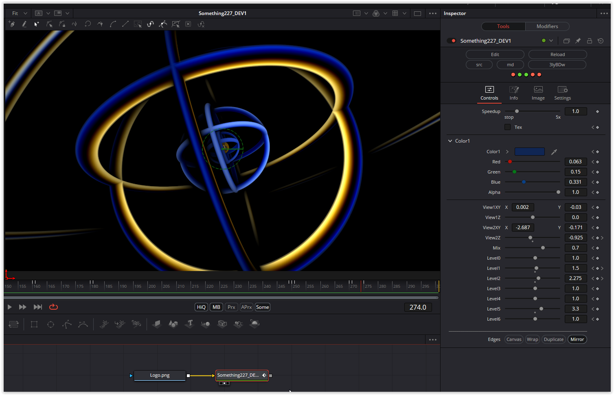

The code of this shader is very short, but it was quite challenging during the conversion, as some specialties emerged during the programming that could not be translated into DCTL. Eventually, a way and a deeper understanding of the For/Next loop was found.

### Description of the Shader in Shadertoy:
3d