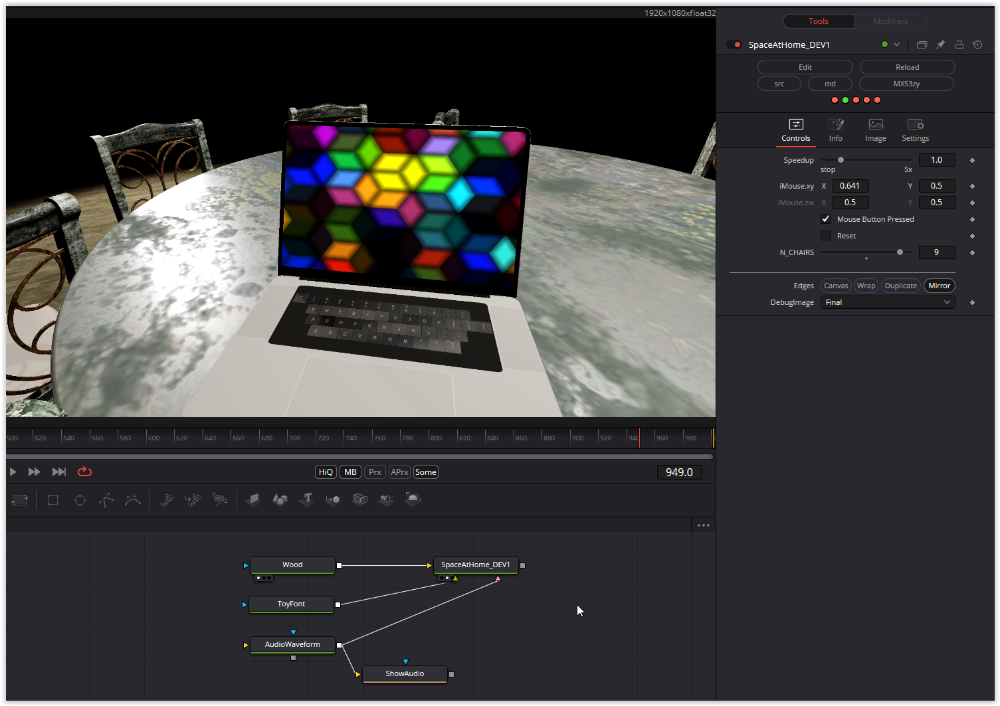

A very complex one and with challenges regarding conversion.
An automatic process starts; after clicking on the mouse parameter, the scenes can be moved through with the X position. The surface of the table, parquet and chairs is defined at the first image input, the second input is intended for the keyboard of the laptop, here the shader toy font is used and the third input is an audio input through which the appearance is controlled by the amplitude of the audio can be.
The number of chairs can be changed using the N_Chairs parameter, but more than 8 chairs cause rendering problems.

Have fun playing

### Description of the Shader in Shadertoy:
Representation of the items at home. Listening to the music I love.
Main animation sequence is 150s then it's a sequence of 6 stills (It never gets fully repetitive, since the laptop does move).