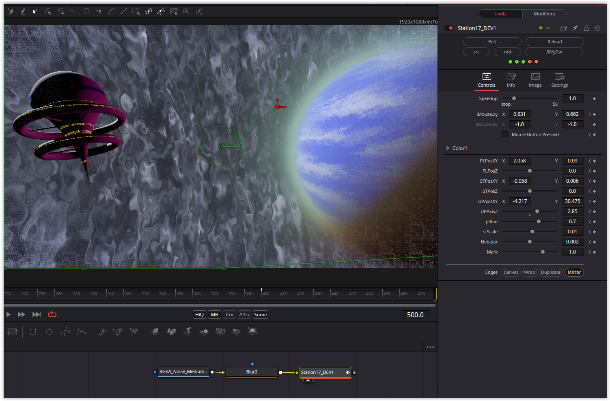

Another fascinating shader. Since Fusion doesn't support volume, I used a standard noise texture to create the planet's surface and nebulae. The planet and station are movable. You can adjust the zoom and rotation using mouse parameters. And almost all colors are customizable.

Have fun playing!

### Description of the Shader in Shadertoy:
inspired partially by star wars
