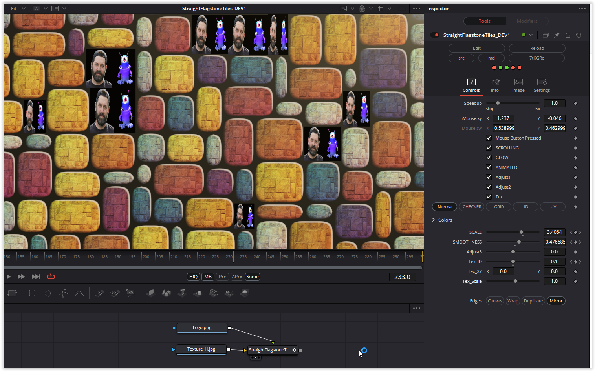

Colorful tiles change size and move across the screen. Here I have made almost all modifications selectable and an additional texture can be displayed in random tiles.

Have fun playing

# Description of the Shader in Shadertoy:
Flagstone/Asymmetric tiling with tile IDs, sizes, and UVs.

