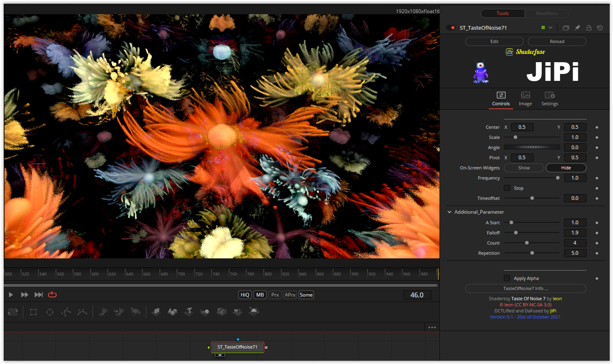

A very nice abstract shader that gets by with only one buffer. I have also added the option of using a texture in this fuse. This can be adjusted using the "Contrast" parameter. You can also play with the parameters AStart, Falloff, Count and Repetition.

Have fun playing

