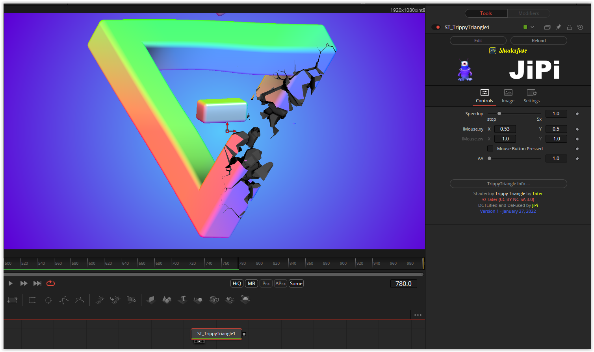

# TrippyTriangle

This Fuse is based on the Shadertoy '_[Trippy Triangle](https://www.shadertoy.com/view/fslcDS)_' by [Tater](https://www.shadertoy.com/user/Tater). Conversion to DCTL and encapsulation into a fuse done by [JiPi](../../Site/Profiles/JiPi.md). See [ShaderOfTheWeek](README.md) for more fuses in this category.

<!-- +++ DO NOT REMOVE THIS COMMENT +++ DO NOT ADD OR EDIT ANY TEXT BEFORE THIS LINE +++ IT WOULD BE A REALLY BAD IDEA +++ -->

Very interesting effect. An anti-aliasing setting and the movement of the camera in the X and Y direction is possible with parameters.

Have Fun playing

<!-- +++ DO NOT REMOVE THIS COMMENT +++ DO NOT EDIT ANY TEXT THAT COMES AFTER THIS LINE +++ TRUST ME: JUST DON'T DO IT +++ -->

## Compatibility

⬛ macOS / Metal: NOT TESTED! 
⬛ macOS / OpenCL: NOT TESTED! 
🟩 Windows / CUDA: checked 
🟩 Windows / OpenCL: checked 

## Problems

Number of problems: 3

- Thumbnail seems to be not a 320x180 pixel PNG
- macOS_Metal compatibility not checked
- macOS_OpenCL compatibility not checked

