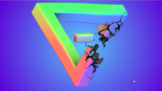

# TrippyTriangle

Based on '_[Trippy Triangle](https://www.shadertoy.com/view/fslcDS)_' by [Tater](https://www.shadertoy.com/user/Tater) and ported by [JiPi](../../Site/Profiles/JiPi.md).

Very interesting effect. An anti-aliasing setting and the movement of the camera in the X and Y direction is possible with parameters.

Have Fun playing

## Compatibility
- [ ] Tested on macOS/Metal
- [ ] Tested on macOS/OpenCL
- [x] Tested on Windows/Cuda
- [x] Tested on Windows/OpenCL
