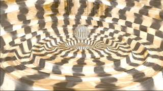

# TwizzlyCircleMess

Based on '_[Twizzly Circle Mess](https://www.shadertoy.com/view/sltGRj)_' by [SnoopethDuckDuck](https://www.shadertoy.com/user/SnoopethDuckDuck) and ported by [JiPi](../../Site/Profiles/JiPi.md).

## Compatibility
- [ ] Tested on macOS/Metal
- [ ] Tested on macOS/OpenCL
- [X] Tested on Windows/Cuda
- [X] Tested on Windows/OpenCL
