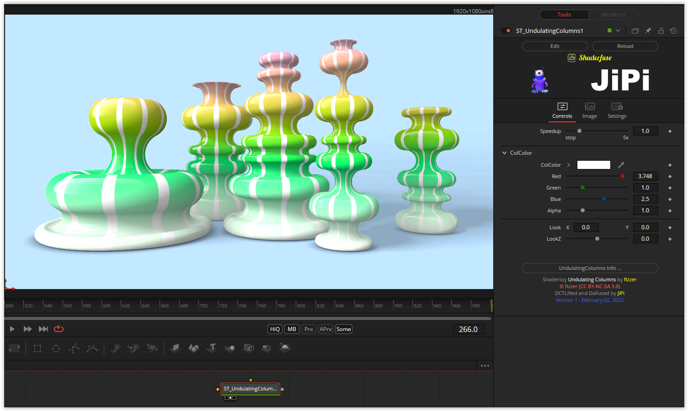

A simple but beautiful shader. A cubemap can be connected to Image1-Input and thus a three-dimensional illumination can be achieved. A noise pattern can be applied to Image2-Input, but this has hardly any influence on the shader.

Have fun playing

