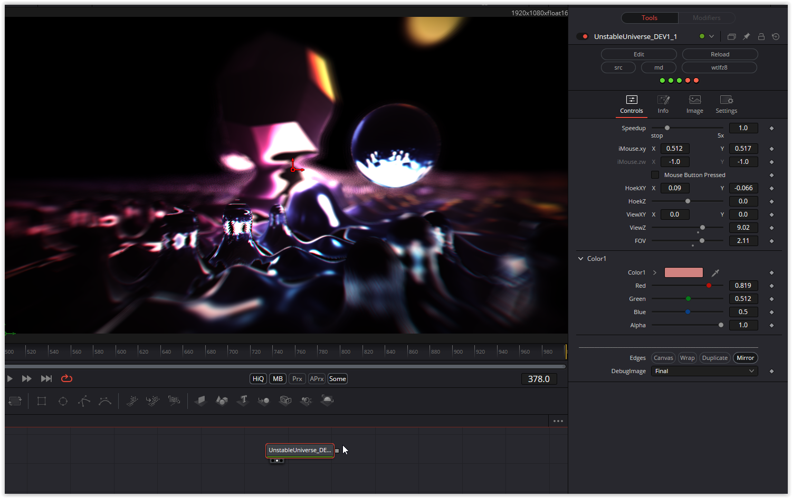

A very nice game with reflection and colors and very compact code

Have fun playing

### Description of the Shader in Shadertoy:
The shader compiles perfectly on one computer but when i checked on another macbook using the same browser (brave) I only see a black screen.. anybody have any idea as to why?