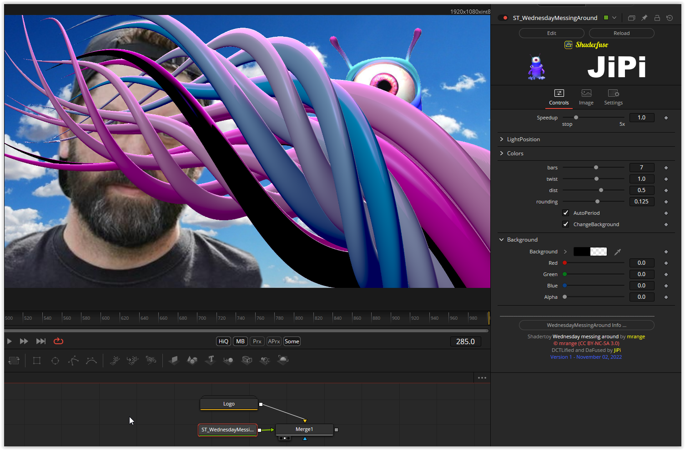

<!-- +++ DO NOT REMOVE THIS COMMENT +++ DO NOT ADD OR EDIT ANY TEXT BEFORE THIS LINE +++ IT WOULD BE A REALLY BAD IDEA +++ -->

Several intertwined bands of different colors meander through the image. There are many parameters to play with. An automatic process shows 4 different variants, which can also be set manually. The background color can be used transparently to design your own textures. Not all parameters apply to all variants.

Have fun playing

<!-- +++ DO NOT REMOVE THIS COMMENT +++ DO NOT EDIT ANY TEXT THAT COMES AFTER THIS LINE +++ TRUST ME: JUST DON'T DO IT +++ -->
