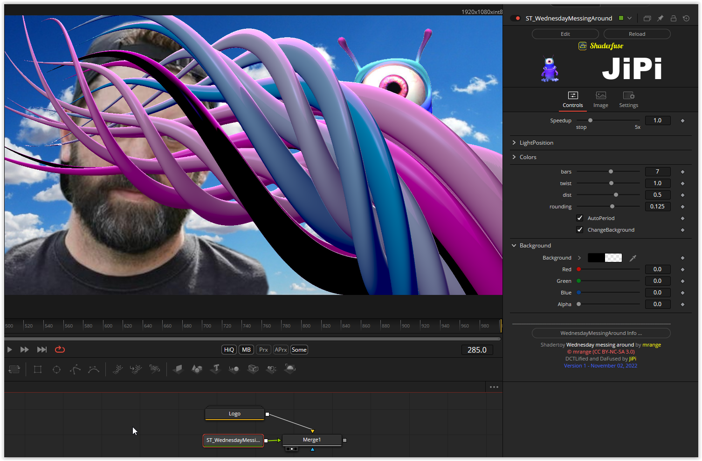

Several intertwined bands of different colors meander through the image. There are many parameters to play with. An automatic process shows 4 different variants, which can also be set manually. The background color can be used transparently to design your own textures. Not all parameters apply to all variants.

Have fun playing

