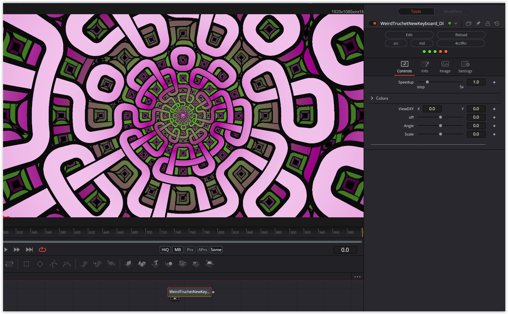

Once again two shaders published in one week in this section :-)
There was a problem with the fwidth function, which does not exist in DCTL and so a simulation is necessary. But here an interesting effect occurred. When the resolution was changed, the shader image was blurred from the outside to the inside. A rounding error was the cause of this. The effect can be made visible with the "off" parameter.

Have fun playing

### Description of the Shader in Shadertoy:
Got this tiny Corne knock-off type keyboard from Amazon - 36 key
https://bsky.app/profile/byt3m3chanic.bsky.social/post/3lbsqbatwjc2q

So this is me trying to code a shader, and memorize the key combos for the special/math chars.