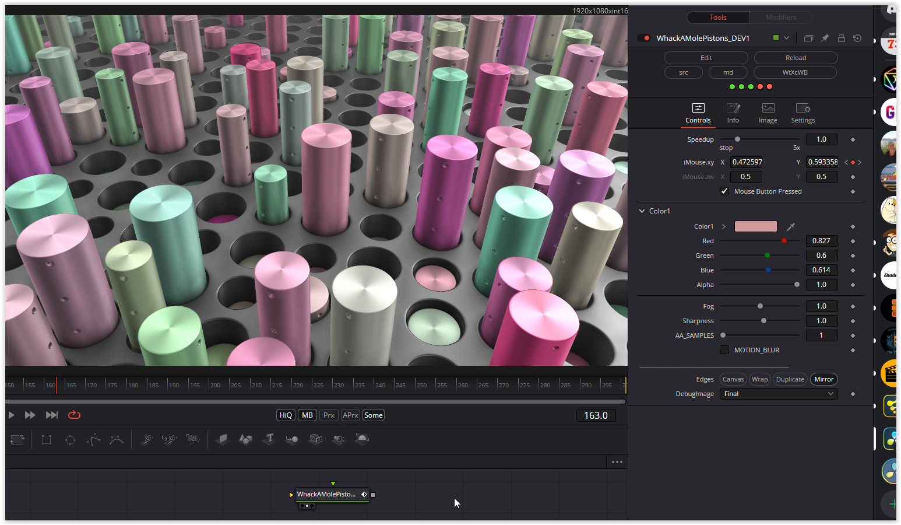

A slightly older, but not bad shader. Very nice reflective surface created by an interesting calculation. Also the hash calculation is exceptional by using "floatBitsToInt".

The view can be changed with the help of the mouse parameters. The base color of the pistons can be customized. To use the "Sharpness" parameter, it is necessary to bind a texture to iChannel0. A texture is required on iChannel1 to use the MOTION_BLUR.

### Description of the Shader in Shadertoy:
experimenting with 2D slicing the sphere packing SDF to get an array of circles of different sizes.

New: [url=https://youtu.be/I8fmkLK1OKg]The tutorial video[/url]

