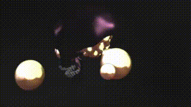

  

Another great skull shader by Kris Katur. To visualize the brain, a cube map is required, which is connected to the input of the fuse.

Have fun playing!

### Description of the Shader in Shadertoy:
In this shader, I revisit previous releases and added a brain to my skull.
"DULL SKULL"
[url]https://www.shadertoy.com/view/DlyyWR[/url]
"DULL SKULL Prologue"
[url]https://www.shadertoy.com/view/4XsfDs[/url]