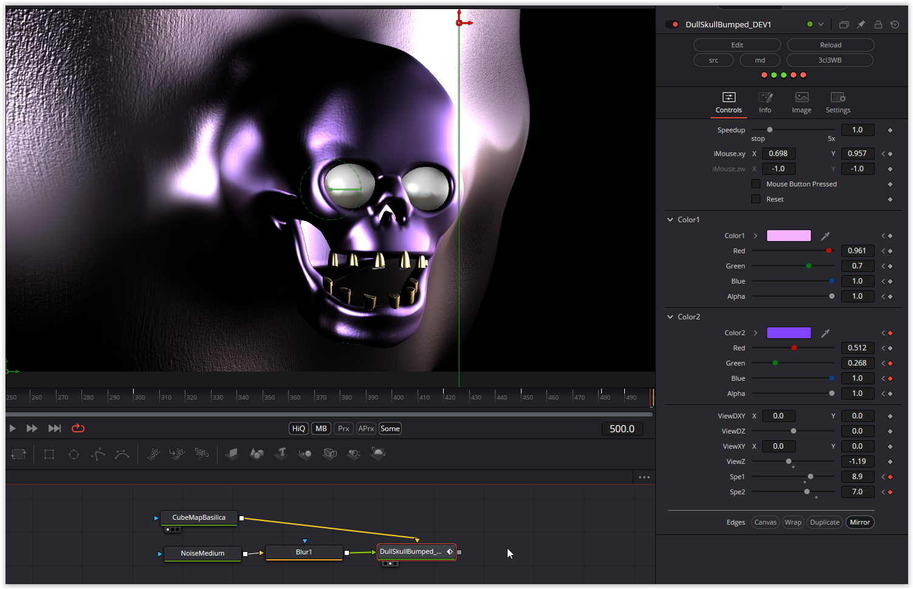

  

Another great skull shader by Kris Katur. To make the shader visible, a cube map is required, which must be connected to the first input (iChannel0) of the Fuse. The second input is a noise texture that distorts parts of the object. A noise texture should be adjusted using a downstream blur node to prevent excessive surface distortion.

Have fun playing!

### Description of the Shader in Shadertoy:
Another version of my "DULL SKULL" experimenting with smooth color mixing and bump mapping.
[url]https://www.shadertoy.com/view/4XsfDs[/url]
DULL SKULL
[url]https://www.shadertoy.com/view/DlyyWR[/url]
[url]https://www.shadertoy.com/playlist/c3sXWn[/url]
