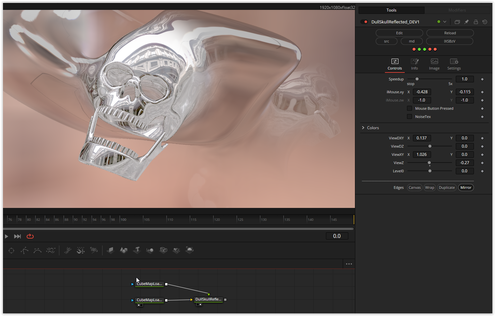

  
Another great skull shader by Kris Katur. To make the shader visible, a cubemap for the skull is required, which must be connected to the first input (iChannel0) of the fuse, as well as a second cubemap (iChannel1) for the background, which must be closed. The "NoiseTex" and "Level0" parameters are currently unused.

Enjoy playing!

### Description of the Shader in Shadertoy:
In this shader, I revisit previous works, experimenting with domain repetition, reflection, and smooth color/texture blending.
"DULL SKULL" Playlist
[url]https://www.shadertoy.com/playlist/c3sXWn[/url]
